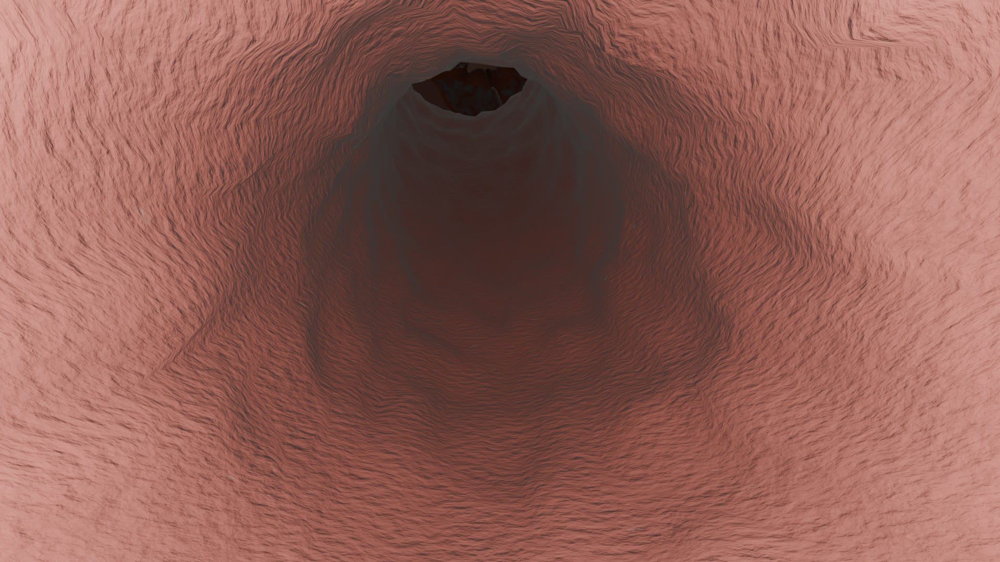
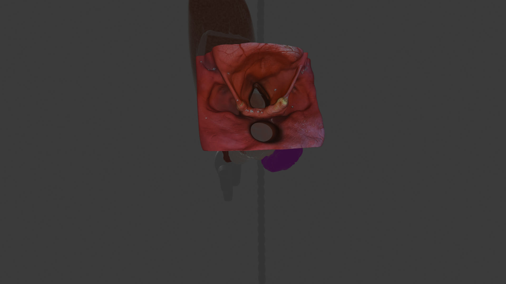
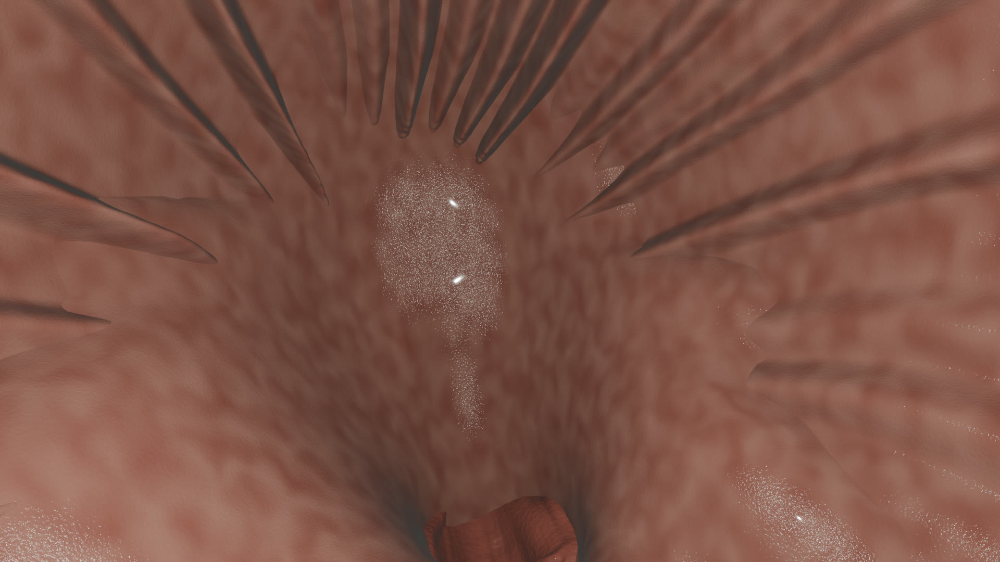
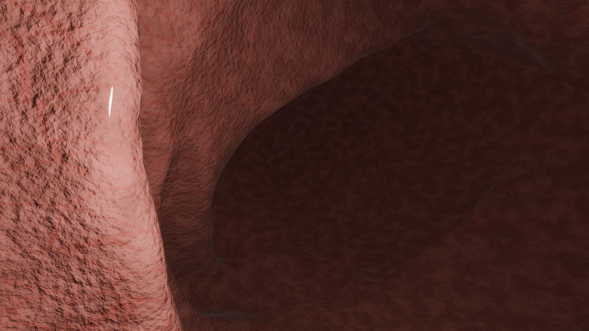
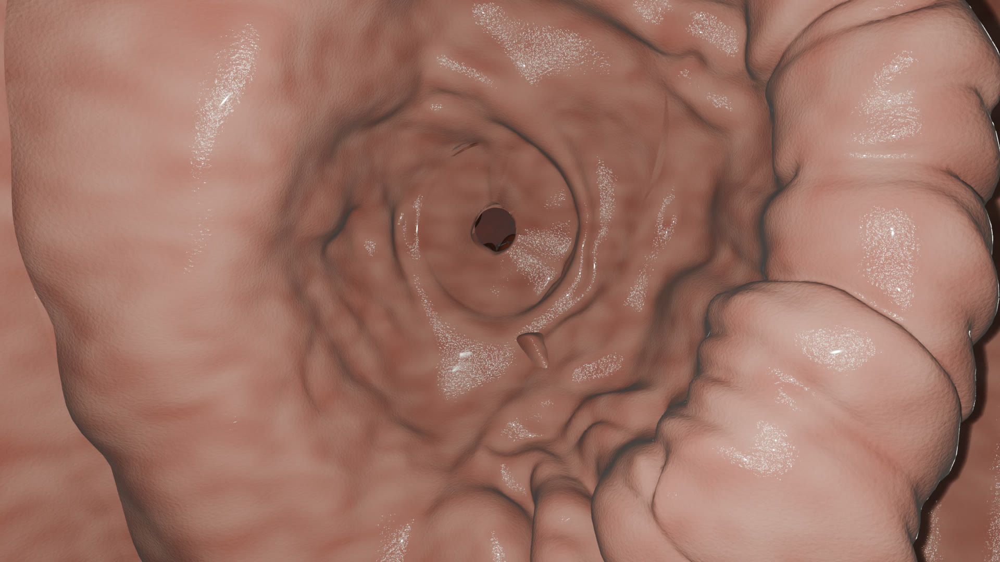
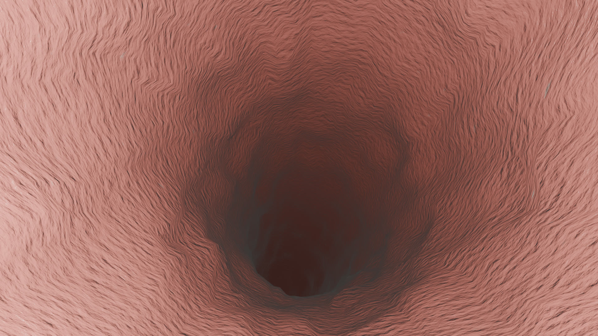
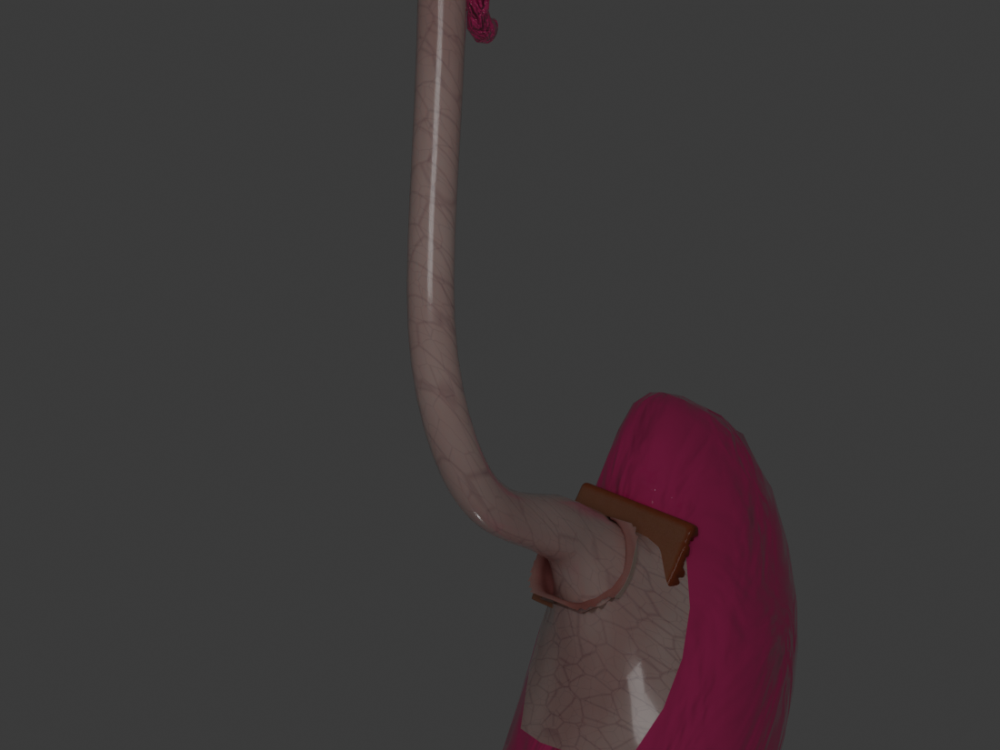

# Endoscopic Stomach Simulation — Blender Production

The Blender source for an **endoscopic stomach simulation**: a complete upper-GI
interior — hypopharynx through pylorus — assembled as a single continuous shell that
a virtual endoscope camera can fly through, rendered as a 60-second flythrough and
exported to Unity for real-time navigation.



> **Disclaimer:** For **educational and visualization purposes only**. Not a medical
> device, and not for clinical, diagnostic, or treatment use.

## The flythrough

**[`renders/Endoscope_Flythrough_v17_1080p24.mp4`](renders/Endoscope_Flythrough_v17_1080p24.mp4)** — 60 s, 1920×1080, 24 fps.

Rendered from `Stomach_Shell_v7_Manual edit done.blend` in **EEVEE** at 40 samples
through the `Cam_Endoscope` camera: 1,440 frames, ~4.5 s/frame, in three resumable
batches. `renders/render_log.txt` is the full per-frame log of that run.

| | | |
|---|---|---|
|  |  |  |
| Hypopharynx — entry | Descending lumen | Gastric folds |
|  |  |  |
| Antrum approach | Pylorus | Esophagus, post-edit |

## How it was built

The stomach interior is not one sculpt. Each anatomical landmark was produced
separately and then merged into a shared shell, so a region could be re-authored
without disturbing the rest:

1. **Reference** — real endoscopy imagery for each landmark.
2. **Generate** — reference images converted to 3D surfaces in 3D AI Studio, which
   returns a mesh plus a **Color / NormalGL / ORM** PBR texture set.
3. **Clean up** — retopology, scale and orientation fixes, and manual sculpting in
   Blender. Each `W*/` folder keeps both the raw generated FBX and the larger
   `image_edited_*` / `Untitled_design_*` FBX that came out of that cleanup.
4. **Merge** — the cleaned region is joined into the running stomach shell, producing
   the next `Stomach_Shell_v*` version.
5. **Render / export** — EEVEE flythrough for presentation, FBX for Unity.

### Anatomical regions

| Folder | Landmark | Anatomy |
|---|---|---|
| `W0_Hypopharynx/` | Hypopharynx | Throat interior — where the scope enters |
| `W1_GEJ_ZLine/` | GEJ / Z-line | Gastroesophageal junction; the squamocolumnar transition |
| `W2_Cardia_Retroflexed/` | Cardia | Retroflexed view looking back at the cardia from inside the fundus |
| `W5_Antrum/` | Antrum | Distal stomach approaching the outlet |
| `W6_Pylorus/` | Pylorus | The sphincter opening into the duodenum |

The `W` numbering is the production order the shell was built up in.

## Repository contents

| Path | Description |
|---|---|
| `Stomach_Shell_v7_Manual edit done.blend` | **The final shell** — all regions merged, manually corrected (122 MB) |
| `checkpoint_v7_2026-08-10.blend` | v7 checkpoint, lighter scene state (80 MB) |
| `Stomach.blend` | The original base stomach mesh the shell was grown from |
| `Rugae Folds.fbx`, `Stomach checkpoint.fbx` | Gastric rugae and an intermediate shell export |
| `W0…W6/` | Per-region source meshes and PBR texture sets |
| `renders/` | Encoded flythrough, selected stills, and the render log |
| `stomach_workflow_plan.docx` | Pipeline and naming conventions |
| `Endoscopic_Simulation_Schedule.docx` | Original production schedule (historical) |
| `CLAUDE.md` | Working notes and rules for AI-assisted sessions in this folder |

### What is deliberately not tracked

`.gitignore` excludes ~4.9 GB of regenerable or redundant local files: the 1,440 raw
PNG frames in `render_v17/` (3.5 GB — the encoded video and stills stand in for them),
Blender `.blend1` autosaves (542 MB), the 3D AI Studio download `.zip`s that duplicate
the extracted FBXs (401 MB), and six superseded large shell checkpoints (~477 MB).
Those checkpoints still exist locally; only the final v7 shell and its checkpoint are
published.

## Getting the files

`*.blend`, `*.fbx`, and `*.mp4` are stored in **Git LFS**. Install and initialize it
*before* cloning, or you will get pointer files instead of models:

```bash
git lfs install
git clone https://github.com/IlmunIslam/stomach-endoscopy-simulation.git
```

Open the `.blend` files with **Blender 4.2 or newer** (the v7 shell was last saved from
a 5.x build; the flythrough was rendered on Blender 5.1.2).

## Related projects

- [Stomach_URP](https://github.com/IlmunIslam/Stomach_URP) — the Unity URP real-time build, with an endoscopy vignette shader
- [Stomach_HDRP](https://github.com/IlmunIslam/Stomach_HDRP) · [StomachFolds_HDRP](https://github.com/IlmunIslam/StomachFolds_HDRP) · [Stomach_Endoscopy_Reduced](https://github.com/IlmunIslam/Stomach_Endoscopy_Reduced) — HDRP and optimized Unity variants
- [vr-colon](https://github.com/IlmunIslam/vr-colon) — the colon counterpart
- [mitochondria-3d](https://github.com/IlmunIslam/mitochondria-3d) — related biological modelling

## License

Released under the **MIT License** — see [LICENSE](LICENSE).
